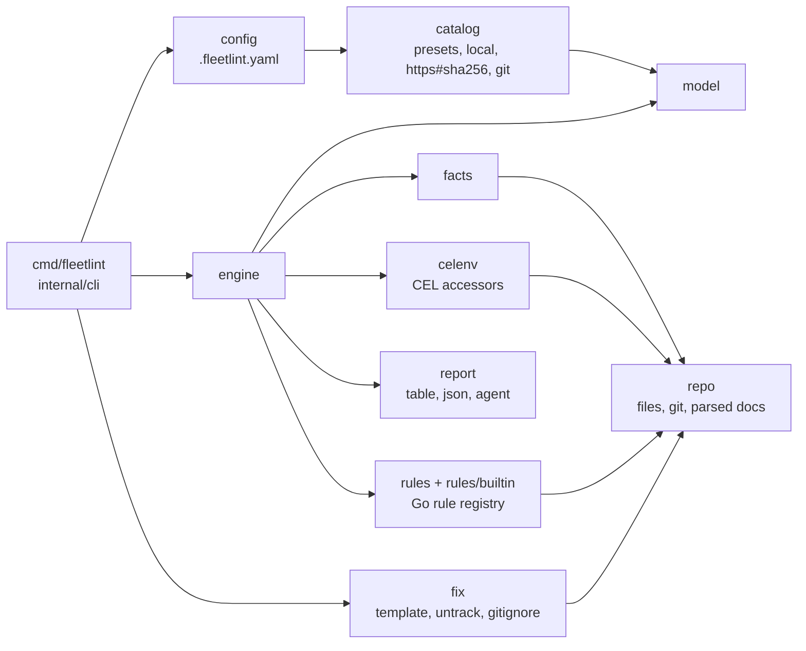

# Architecture

Dependencies point inward: `cli → engine → {config, facts, celenv, rules} → repo → model`. Nothing below `cli` knows about flags or output formats; nothing below `engine` knows about catalogs.

## Where things live

| Package | Responsibility | Invariant |
|---|---|---|
| `model` | Rule, Finding, Result, Severity, Exception | no dependencies on other packages |
| `repo` | one repository's files, git data and parsed YAML/TOML/JSON/Makefile, memoized | every path is confined to the repo root; nothing outside is read |
| `facts` | discovery of stacks, forge, visibility, tier, layout, CI, release, task runner, hooks | each fact records its source: detected, configured, default |
| `celenv` | the CEL environment: variables and accessor functions rules may use | the only surface `expr` rules see; documented from this package |
| `catalog` | catalog format, presets embedded in the binary, local, https and git loading, digest verification, includes | https catalogs require a digest, git catalogs a digest or a commit SHA; untrusted catalogs cannot declare `command` rules |
| `forge` | read-only GitHub and Gitea REST client: an owner's repositories, one repository's visibility | used only by `fleet --from` and `init`; `check` never contacts a forge; tokens come from the environment and go to their own forge only |
| `config` | `.fleetlint.yaml`: validation, merge with catalogs, overrides, exceptions | unknown keys, unknown ids, disables without reason are errors |
| `rules`, `rules/builtin` | Go-implemented rules and their registry | the catalog carries metadata; Go carries only detection logic |
| `engine` | applicability, evaluation, exceptions, scopes | a rule that cannot run is `error`, never `pass` |
| `fix` | declarative fix actions: template, untrack, gitignore | dry run unless applied; never overwrites an existing file |
| `report` | rendering | reads results; never recomputes |
| `cli` | commands, flags, exit codes | thin; delegates everything |

## Data flow of `fleetlint check`

1. `cli` opens the repo and loads `.fleetlint.yaml` (or the defaults).
2. `config` resolves `extends` through `catalog`, applies `rules:` overrides and validates `exceptions:`.
3. `engine` discovers facts for the root and each scope, builds a CEL environment per scope, and evaluates every loaded rule: tier/stack/`when` filter → `expr` or Go checker → findings → exceptions.
4. `report` renders; `cli` maps the summary to an exit code.

## Decisions

See `docs/adr/`.
